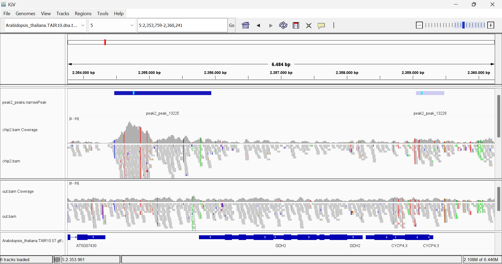

---
output:
  word_document: default
  html_document: default
---
# Análisis de ChIP-seq de LEC1: cistroma, reguloma y análisis de los motivos de unión al ADN

#### Carmen Giles Floriano, Diana Andreea Baicea, Lucía Rodríguez Ramírez, Lucía Tejero Miranda y Vicente Revilla López

## Introducción

El **desarrollo de las semillas** es un proceso temporalmente bifásico. Tras la fertilización del óvulo y las células centrales, el embrión y el endospermo pasan por la fase de morfogénesis, en la que tienen lugar procesos de proliferación celular y nuclear, especificación y establecimiento de subregiones y dominios y la diferenciación de tejidos y células. Esta fase se superpone parcialmente con la fase de maduración, en la que la proliferación celular y la morfogénesis se detienen, macromoléculas de almacenamiento como lípidos y proteínas se acumulan en orgánulos en grandes cantidades y el embrión adquiere la capacidad de resistir la desecación. Al final del desarrollo, tanto el embrión como el endospermo quedan metabólicamente inactivos hasta que la semilla germina. 

**Leafy cotyledon 1 (LEC1)** es una **subunidad atípica del factor de transcripción nuclear Y (NF-Y)**, factor de transcripción de unión a CCAAT. Este es un regulador central que controla muchos aspectos del desarrollo de las semillas, incluida la etapa de maduración en la que tiene lugar el almacenamiento de macromoléculas y la adquisición de la capacidad de resistencia a la desecación.


### Antecedentes

Se ha observado que mutaciones de pérdida de función en *lec1* causan defectos en el almacenamiento de las macromoléculas, en la habilidad de resistir a la desecacion y en la supresión de la germinación y el inicio de los primordios foliares. 

La expresión de genes que codifican para proteínas de almacenamiento, de cuerpo oleoso y reguladores transcripcionales de la fase de maduración son defectuosas en dichos mutantes. Además de regular los genes de maduración, la expresión ectópica de *lec1* regula positiva y negativamente los genes implicados en las **respuestas hormonales** y a la baja los genes que responden a la **luz** en las plántulas. Esto sugiere que LEC1 controla otros aspectos del desarrollo además de la maduración, en cuya regulación presenta gran importancia. Sin embargo, aún no se han identificado las redes de dicho gen que controlan las diversas etapas del proceso de desarrollo.


### Objetivo

El objetivo del estudio  de *Pelletier et al., 2017*,
 en el cual basamos nuestro análisis, es definir las redes génicas y los procesos de desarrollo controlados por LEC1, identificando los **genes regulados**, tanto directa como indirectamente, por este factor. Se realiza un análisis ARN-seq donde se compara el perfil de ARNm del fenotipo silvestre y de un mutante para *lec1* en distintas etapas del desarrollo para definir genes que están regulados por efecto de la mutación. Se hace uso del método bioquímico **Chromatin Immunoprecipitation Sequencing (ChIP-seq)**, el cual nos permite determinar los sitios de unión en el genoma del factor de transcripción estudiado. En este caso, se realiza el análisis a semillas de *Arabidopsis Thaliana* en desarrollo para identificar los **genes diana** que son regulados transcripcionalmente por LEC1.

En nuestro caso, nos centramos en el análisis de ChIP-seq y tratamos de comparar los resultados obtenidos con los del artículo de referencia. 


## Materiales y Métodos

### Diseño Experimental

Número de acceso en GEO: GSE99587

En el estudio, realizaron un análisis de ChIP-seq para dos muestras (chip), cada una con su respectivo input, resultando un total de 4 muestras.  Las muestras chip consisten en 2 réplicas biológicas de semillas de Arabidopsis en estadío de desarrollo que presentan una mutación homocigótica para *lec1*.
Expresaron una variante de LEC1 unida a GFP en dichos mutantes nulos para *lec1* y, mediante unión a un anticuerpo anti-GFP, llevaron a cabo el análisis de ChIP-seq.

  * **Muestra chip**: semillas de *Arabidopsis Thaliana* con expresión del gen LEC1 unido a GFP. Estas fueron sometidas a sonicación para obtener fragmentos de la cromatina y, posteriormente, se incubaron con anticuerpo anti-GFP para realizar la inmunoprecipitación. 
    - Réplica 1
    - Réplica 2
  
  * **Muestra input**: control. Fueron obtenidas por el mismo procedimiento que las muestras chip, pero con la diferencia de que se incubaron con anticuerpos inespecíficos. 
    - Réplica 1
    - Réplica 2

### Flujo de trabajo

Para comenzar este proyecto, primero hay que construir el **espacio de trabajo** en el terminal. A su vez, se deben descargar el genoma y la anotación del organismo que vaya a ser utilizado en el estudio, así como, las muestras biológicas utilizadas (GEO NCBI). Además, se realiza un **análisis de calidad** de las muestras para comprobar que no estén contaminadas.

Se prosigue construyendo un índice del genoma de referencia y el posterior mapeo de lecturas al genoma, ambos pasos utilizando el comando *bowtie2*, obteniendo un archivo **.sam**. Dado que este archivo es excesivamente pesado, se pasa a formato **.bam** mediante la herramienta *samtools* y se realiza un índice de éste mediante samtools index, obteniendo un archivo **.bam.bai**.

Tras ello, se hace la determinación de los picos con *macs2 callpeak*, obteniendo un archivo **.narrowPeaks**. Se utiliza el programa IGV para visualizar los picos, los cuales nos indican los probables sitios de unión de nuestro factor de transcripción. 

Por otro lado, mediante el uso de Rstudio (*RStudio Team, 2020*), se realiza la anotación de los picos con la función *annotatePeak*, se convierte la anotación en data frame (*as.data.frame*) y se lleva a cabo el enriquecimiento funcional para dilucidar si los genes regulados por el FT participan en un proceso biológico común.

Por último, se utiliza el software HOMER para la determinación de motivos de ADN en los sitios de unión del factor de transcripción.


### Script de bash

Tras preparar el espacio de trabajo, lo primero que hacemos es cargar las muestras en el terminal. Lo hacemos con el comando *fastq-dump* seguido del SRA de la muestra en concreto. Esto lo repetimos tantas veces como muestras haya que descargar, en nuestro caso 4 veces (chip1, chip2, input1, input2)

Tras ello, se realiza un **análisis de calidad** de las muestras para comprobar que no hay contaminación ni ruido en exceso (comando *fastqc*).


Al realizar el análisis, vemos que todas las muestras presentan una alta calidad en todas las categorías, como observamos en el ejemplo de la réplica 1 de chip. Esto indica que no existe contaminación y podremos obtener unos resultados fiables.


Después, realizamos un **índice del genoma** de referencia (herramienta *bowtie2-build*) que vamos a necesitar para el **mapeado** de nuestras muestras. Esto nos devuelve un archivo SAM para cada muestra. Se realiza mediante el comando bowtie2 con los siguientes argumentos: -x para especificar la ruta del fichero del índice del genoma de referencia, -U para especificar el fichero .fastq que estamos mapeando, y -S para indicar el nombre del fichero de salida e indicar que el formato de almacenamiento es el **SAM (Sequence Alignment Map)**.


Vemos que el porcentaje de alineamiento global para la muestra chip1 es del **90,23%**.

Como el formato SAM es muy pesado, resulta complejo trabajar con él, por lo que lo convertimos en un archivo **BAM (Binary Alignment Map)** que, al ser un formato binario, ocupa mucho menos espacio. Esto lo hacemos con la herramienta *samtools* con argumentos sort (para ordenar las lecturas) y -o para especificar el nombre y el formato del archivo de salida.


Una vez obtenido el BAM, realizamos un índice del mismo mediante *samtools index*, generando un archivo **.bam.bai**.
Hacemos un ls y un du -h * para ver que se nos ha generado todo correctamente.

Recordemos que este mismo procedemiento, se realiza para la muestra chip2.


Para las muestras **input**, el procedimiento es algo diferente: generamos los archivos SAM y BAM exactamente igual que antes; sin embargo, posteriormente, se deben fusionar en un mismo archivo, pues es necesario para la determinación de picos. Esto se hace mediante *samtools merge* <archivo de salida> <input1.bam> <input2.bam>. Al archivo generado (**out.bam**) le realizamos un índice con *samtools index* para el siguiente paso.


Proseguimos con la **determinación de picos**. Accedemos a la carpeta results y, para realizar la llamada, utilizamos la herramienta *macs2 callpeak* con los siguientes argumentos:

  * -t: especificar la muestra chip
  * -c: especificar la muestra input 
  * -f: especificar el formato del chip y el input (BAM)
  * --outdir: especificar el directorio de salida (en este caso el actual, representado por un .)
  * -n: prefijo común de todos los archivos que se van a generar.

En primer lugar, hacemos una determinación para cada muestra chip respecto a out.bam con el objetivo de comparar ambos resultados en el programa IGV.


Por último, fusionamos los archivos .narrowPeak de los chip mediante el comando *bedtools intersect* con argumentos:

  * a → archivo .narrowPeak de chip1.
  * b → archivo .narrowPeak de chip2.

El archivo resultante se guarda bajo el nombre de **LEC1.narrowPeak**, este contendrá la intersección de los picos de ambas muestras, de forma que si un pico sólo aparece en una de las muestras no aparecerá en este archivo global. LEC1.narrowPeak se utilizará en el script de R para estudiar el enriquecimiento funcional. 

Comprobamos que se han generado todos los archivos y que todos tienen un peso coherente.


## Resultados 

### Análisis de la distribución global del Cistroma


```{r, echo=FALSE, message=FALSE, warning=FALSE}
library(ChIPseeker)
library(TxDb.Athaliana.BioMart.plantsmart28)
```


```{r}
txdb <- TxDb.Athaliana.BioMart.plantsmart28

LEC1.peaks <- readPeakFile(peakfile = "LEC1.narrowPeak",header=FALSE)

length(LEC1.peaks)
```

Según el análisis realizado a través de *ChIPseeker*, hay **15579 picos**.

Para definir la región que se considera promotor entorno al punto de **inicio de la transcripción (TSS)** usamos la función *getPromoters*.

```{r}
promoter <- getPromoters(TxDb=txdb, 
                         upstream=1000, 
                         downstream=1000)
```


A continuación, anotamos los picos obtenidos a través del terminal con el comando *macs2* y visualizamos los resultados en distintos gráficos.

```{r, message=FALSE, warning=FALSE, comment=FALSE}
LEC1.peakAnno <- annotatePeak(peak = LEC1.peaks, 
                              tssRegion=c(-1000, 1000),
                              TxDb=txdb)
```

  * **Pie Chart**
```{r, echo=FALSE}
plotAnnoPie(LEC1.peakAnno)
```

**Gráfico 1** - *Representación de diferentes regiones génicas sobre las cuales actúa LEC1, siendo la región promotora la predominante.*

Observamos que los picos de la **región promotora** son los más dominantes (**76,28%**), seguidos de las regiones intergénicas distales (15,97%). Este resultado nos indica que el factor de transcripción LEC1 actúa regulando diversos genes principalmente a nivel del promotor.

  * **Bar Plot**
```{r, echo=FALSE}
plotAnnoBar(LEC1.peakAnno)
```

**Gráfico 2** - *Representación de diferentes regiones génicas sobre las cuales actúa LEC1, siendo la región promotora la predominante.*

A continuación, podemos observar otro tipo de representación gráfica en la cual se aprecia la **prevalencia de la unión de LEC1 a las zonas promotoras**, pero también podemos destacar en menor medida las regiones intergénicas y las 3’UTR.

  * **Distribución genómica del loci en relación al TSS**
```{r, echo=FALSE}
plotDistToTSS(LEC1.peakAnno,
              title="Distribution of genomic loci relative to TSS",
              ylab = "Genomic Loci (%) (5' -> 3')")
```

**Gráfico 3** - *El 75% de los picos se encuentran muy cercanos al TSS.*

En este gráfico se representa la distribución de los picos del TSS. Se puede observar que alrededor del **45% de los picos** se encuentran **aguas arriba a 0-1 kb del TSS**, mientras que alrededor del **30% de los picos** se encuentran **aguas abajo** a esa misma distancia. Como podemos ver, alrededor del 75% de los picos se encuentran muy cercanos a dicho punto (0-1 kb). 

  * **Visualización de los picos con IGV**

Realizamos una visualización con IGV (*Thorvaldsdóttir, 2012*)
 de los picos obtenidos tras el mapeo. Analizamos algunos genes que también se destacan en el artículo de referencia, en concreto AT5G07440 (*gdh2*), AT5G07500 (*pei1*) y AT5G07530 (*grp17*). 

En el caso de los genes *gdh2* y *pei1*, vemos que en ambas muestras obtenemos picos que tienden a posicionarse en las regiones cercanas al promotor del gen. Esta visualización confirma lo obtenido en los gráficos anteriores, LEC1 se une preferentemente a los promotores.Con respecto al gen *grp17*, podemos ver un caso en el cual el factor de transcripción LEC1 no ejerce efecto sobre su promotor.

Estos resultados coinciden con lo obtenido en el artículo de referencia. 





### Análisis del Reguloma del correspondiente factor de transcripción o marca epigenética. 

Una vez anotados los picos, convertimos dicha anotación en un marco de datos para así poder llevar a cabo el análisis de enriquecimiento funcional.

```{r}
LEC1.annotation <- as.data.frame(LEC1.peakAnno)

target.genes <- LEC1.annotation$geneId[LEC1.annotation$annotation == "Promoter"]

write(x = target.genes,file = "LEC1_target_genes.txt")

length(target.genes)

```

En primer lugar, hemos obtenido el número de genes que constituye el reguloma de nuestro factor de transcripción en estudio, LEC1. En este caso, se ha encontrado que **11883 genes** son regulados por LEC1. 

Para visualizar el reguloma, pinche [aquí](LEC1_target_genes.txt).  


```{r, echo=FALSE, message=FALSE, warning=FALSE}
library(clusterProfiler)
library(org.At.tair.db)
library(enrichplot)
library(ggnewscale)
library(enrichplot)
```


```{r}
LEC1.enrich.go <- enrichGO(gene = target.genes,
                           OrgDb         = org.At.tair.db,
                           ont           = "BP",
                           pAdjustMethod = "BH",
                           pvalueCutoff  = 0.05,
                           readable      = FALSE,
                           keyType = "TAIR")
```

Una vez realizado en R un análisis del **enriquecimiento funcional** del conjunto de genes, representamos los resultados a través de distintos gráficos para poder deducir los procesos biológicos enriquecidos de los genes regulados por LEC1. 

```{r, echo=FALSE}
barplot(LEC1.enrich.go,showCategory = 10, font.size = 10)
```

Tras hacer un **barplot**, podemos observar que el factor transcripcional LEC1 regula genes relacionados, en gran parte, con la **respuesta a la luz** y a su **intensidad**, aunque también aparecen de forma significativa genes relacionados con la respuesta a distintos **niveles de oxígeno**. Cabe destacar, con un p-valor muy bajo aunque mayor que el del resto de las funciones, la respuesta celular a **estímulos de ácido abscísico**, fitohormona que participa en el crecimiento y desarrollo de la planta, así como, en la adaptación de la misma a condiciones de estrés abiótico o biótico. 
Esto concuerda con el resto de los procesos biológicos, ya que las condiciones de hipoxia (bajos niveles de oxígeno) y el frío forman parte del llamado **estrés abiótico**, aquel causado por condiciones ambientales externas. 

Posteriormente llevamos a cabo un **dotplot**, donde observamos los mismos resultados que en el gráfico anterior. 

```{r, echo=FALSE}
dotplot(LEC1.enrich.go,showCategory = 10, font.size=7.5)
```

Los procesos con mayor importancia son referidos a la respuesta a la **luz roja/roja lejana** y la respuesta a la intensidad de la misma. Esto quiere decir que las plantas, en condiciones de baja intensidad lumínica o altos niveles de luz roja lejana, van en busca de una mayor intensidad lumínica (luz roja) para su desarrollo y crecimiento. Este hecho, junto con otros procesos enriquecidos relacionados con la respuesta al frío o a condiciones de hipoxia, así como, a estímulos de ácido abscísico, nos hace pensar que dicho factor tiene un **gran papel en la respuesta al estrés** de la planta.

Con el objetivo de relacionar los distintos procesos biológicos enriquecidos, llevamos a cabo un **emapplot**. 

```{r, echo=FALSE}
emapplot(pairwise_termsim (LEC1.enrich.go),showCategory = 15, cex_label_category=0.5)
```

Podemos observar que los procesos relacionados con la hipoxia se encuentran conectados entre sí, al igual que las respuestas frente a estímulos medioambientales/abióticos, entre los que se puede encontrar la intensidad de la luz roja. 


### Enriquecimiento de Motivos de DNA en los sitios de Unión

A continuación, se realiza un análisis de los motivos de ADN asociados a las dianas de LEC1 con la herramienta **Homer**, tal y como se realiza en *Heinz et al., 2010*. Se tienen dos conjuntos de motivos: unos no conocidos o de novo y otros conocidos, ya guardados en la base de datos de Homer. Los resultados más relevantes se muestran en las siguentes tablas. Se tiene el p-valor, que debe ser inferior a 1 e-50, el porcentaje de **sitios de unión de LEC1** que poseen el **motivo** (% en dianas) y la cantidad de veces que aparece en promotores a los que este no se une (% en no dianas). Con estos dos últimos parámetros, sabremos si el motivo es específico del sitio de unión del factor.   


Nº | Motivos no conocidos | p-valor | % en dianas | % en no dianas | Tipo
------------ | -------------| ------------- | ----------- | ---------- | -------------
1 |    | 1 e-1458 | 32.38 | 8.95 | G-box, ABRE-like
2 |  | 1e-283 | 11.50 | 4.43 | BPC1


Nº | Motivos conocidos | p-valor | % en dianas | % en no dianas | Tipo
------------ | -------------| ------------- | ----------- | ---------- | ------------
1 |  | 1 e-1254 | 26.38 | 6.77 | G-box, ABRE-like
2 |  | 1 e-1182 | 22.64 | 5.24 | G-box
3 |  | 1 e-1052 | 20.75 | 4.89 | G-box, ABRE-like
4 |  | 1 e-243 | 8.56 | 3 | BPC1
5 |  | 1 e-181 | 14.64 | 7.78 | BPC1
6 |  | 1 e-123 | 17.07 | 10.74 | CCAAT

El resultado más claro es que el factor de transcripción se une a secuencias **G-box**, CACGTG, secuencia asociada a la activación de la transcripción. Este motivo posee el menor p-valor en los motivos encontrados de novo y los conocidos. En estos últimos, esta secuencia se repite en varios motivos obtenidos. Estos resultados coinciden con lo mencionado en el artículo de referencia, dónde se explica que LEC1 es una subunidad del **NF-Y** que interactúa NF-YC y bZIP, los cuales se unen a G-box. Además, en el artículo se menciona que la secuencia **ABRE-like**, (C/G/T)ACGTG(G/T)(A/C), aparece significativamente como un motivo de unión. De la misma forma, esta también aparece en nuestro análisis, solapando con los motivos que contienen la secuencia G-box. Ambos motivos, G-box y ABRE-like, aparecen en un alto porcentaje de las dianas y con un p-valor bajo. 

Por otro lado, al igual que en el artículo de referencia, el motivo **BPC1**, (A/G)GA(A/G)AG(A/G)(A/G)A, aparece significativamente tanto en los motivos obtenidos no conocidos como en los conocidos. Sin embargo, en las dianas aparecen en un porcentaje menor que los anteriores, es decir, parece que LEC1 se une en menor medida a los motivos BPC1. 

Por último, en el artículo se menciona que el complejo NF-Y, del que el factor de transcripción estudiado forma parte, se une a motivos **CCAAT**. Este motivo también es identificado en el análisis realizado en este estudio, dentro de los conocidos. Sin embargo, con respecto a los promotores de *Arabidopsis Thaliana*, este motivo se encuentra en mayor medida en aquellos no relacionados con LEC1 en comparación con los motivos mencionados anteriormente. Esto puede indicar que este motivo es menos específico para este factor. 

Estos resultados muestran que el factor de transcripción LEC1, en algunos casos junto con otros factores, se une a los motivos G-box, ABRE-like, BPC1 y CCAAT. 

## Conclusiones

Como describimos en el objetivo de nuestro análisis, hemos tratado de identificar los genes regulados por el factor de transcripción LEC1 haciendo uso de ChIP-seq. Como resultado de dicho estudio, se tiene que las cumbres de los picos, sitios de unión del factor de transcripción, coinciden mayoritariamente con la zona de los **promotores**. Se obtienen **15579 picos**, de los cuales el 76.8% se encuentran entre 0 y 1kb del punto de inicio de la transcripción (TSS), con un mayor porcentaje de unión a aguas arriba. 

Al igual que los autores del artículo de referencia, hemos analizado en mayor profundidad los genes *gdh2*, *pei1* y *grp17*. De los cuales, en los dos primeros se une LEC1 en zonas cercanas al promotor, mostrando un pico con un score alto. Mientras que GRP17 no presenta dicho pico. 

Por otro lado, como resultado del análisis del reguloma de LEC1, se observa que este presenta un total **11883 genes**. Esto nos lleva a pensar que tal cantidad de genes implica una gran diversidad de procesos biológicos. En nuestro caso, el análisis de enriquecimiento funcional del reguloma se realiza de forma distinta al llevado a cabo por el artículo de referencia, por lo que obtenemos sólo un conjunto parcial enriquecido de dichos procesos biológicos. 

En base a los resultados, se deduce que este factor de transcripción  tiene un papel importante controlando la expresión de los genes implicados en la respuesta a distintos **estreses abióticos** en la planta, como hipoxia, presencia de luz roja/lejana o frío. Estos estreses conllevan a una respuesta de la fitohormona, conocida como **ácido abscísico**, la cual permite la **adaptación de la semilla a estas condiciones desfavorables**, al igual que su correcta germinación y desarrollo.

En cuanto al enriquecimiento de motivos mediante la herramienta HOMER, obtuvimos, al igual que los autores del artículo de referencia, que LEC1 se une preferentemente a **G-box** (CACGTG), **ABRE-like** ((C/G/T)ACGTG(G/T)(A/C)), **BPC1** ((A/G)GA(A/G)AG(A/G)(A/G)A) y **CCAAT**. 

Podemos concluir que nuestros datos se asemejan bastante a los del artículo de referencia, teniendo en cuenta que ellos emplean una metodología más extensa que la usada por nosotros.

Con el objetivo de validar los datos, se podría realizar el siguiente experimento. En primer lugar, sembramos mutantes knock-out para el gen *lec1* y silvestres de *Arabidopsis Thaliana* en distintas condiciones. Entre ellas a distintas temperaturas, niveles de oxígeno e intensidades lumínicas. De esta forma, podríamos observar el efecto del mutante y compararlo con el silvestre, esperando como resultado que el mutante presente más problemas en su desarrollo en las condiciones estresantes, ya que LEC1 ayuda a la planta a crecer en estrés abióticos. Para corroborar esta hipótesis, se puede introducir al mutante el gen *lec1* y comprobar que recupera el fenotipo.  


## Referencias


  * Heinz, S., Benner, C., Spann, N., Bertolino, E. et al (2010). Simple Combinations of Lineage-Determining Transcription Factors Prime cis-Regulatory Elements Required for Macrophage and B Cell Identities. *Mol Cell* 38(4):576-589. 
  
  * RStudio Team. (2020) “RStudio: Integrated Development for R. RStudio”, PBC, Boston, MA URL http://www.rstudio.com/.

  * Thorvaldsdóttir, H., Robinson, J. T., & Mesirov, J. P. (2012). Integrative Genomics Viewer (IGV): High-performance genomics data visualization and exploration. *Briefings in Bioinformatics*, 14(2), 178-192. 

  * Pelletier, J., Kwong, R. W. M., Park, S., Le, B. H., Baden, R., Cagliari, A., Hashimoto, M., Munoz, M., Fischer, R. L., Goldberg, R. B., & Harada, J. J. (2017) LEC1 sequentially regulates the transcription of genes involved in diverse developmental processes during seed development . *Proceedings of the National Academy of Sciences of the United States of America*, 114(32). 
